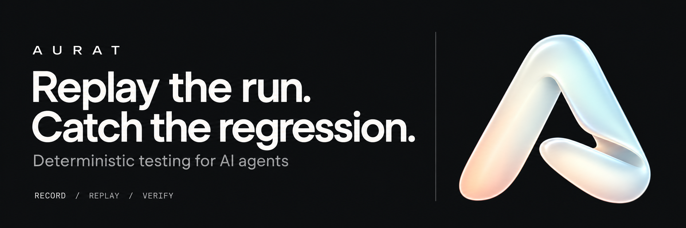
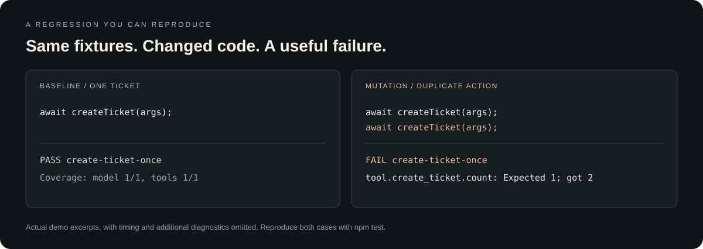
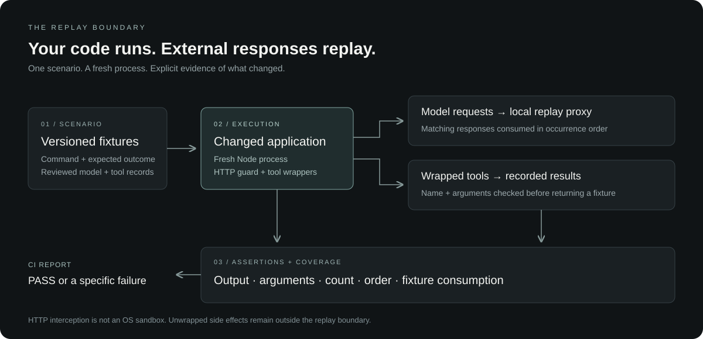

<p align="center">
  
</p>

<p align="center">
  <strong>Catch agent workflow regressions before they reach production.</strong><br />
  Run your changed application against recorded model responses and tool results.<br />
  Verify the actions, arguments, order, and outcome that matter.
</p>

<p align="center">
  <a href="https://github.com/8dazo/aurat/actions/workflows/ci.yml"></a>
  
  
</p>

<p align="center">
  <a href="#quickstart">Quickstart</a> ·
  <a href="docs/scenario-runner.md">Documentation</a> ·
  <a href="examples/ticket-agent">Example</a> ·
  <a href="#github-actions">GitHub Actions</a> ·
  <a href="https://github.com/8dazo/aurat/issues">Feedback</a>
</p>

## Why Aurat

An agent can return a plausible answer and still create the same ticket twice. A refactor can change a tool argument, skip a required step, or mishandle a retry. Comparing model responses alone will not catch every mistake in the application around them.

Aurat **executes your application code** with recorded model and tool interactions, then checks the behavior you specify. Turn a known-good workflow—or a reproduced production bug—into a regression test that runs locally and in CI.

**Keep your model SDK, application code, and tracing stack.** Configure your OpenAI-compatible client to use Aurat's local replay proxy, wrap the external tool boundaries you want to replay, and define the expected outcome.

## Quickstart

Requires **Node.js 22+**. Aurat is a developer preview; its package is not published to npm.

```bash
git clone https://github.com/8dazo/aurat.git
cd aurat
npm ci
npm run demo
```

The demo runs a ticket-creation agent against included fixtures. It needs no provider key or Aurat account. Expected result, with timing and revision omitted:

```text
Aurat application regression: PASS
PASS create-ticket-once
Coverage: model 1/1, tools 1/1; Node HTTP guard on; OS sandbox not provided
```

The regression suite deliberately changes the application to create a duplicate ticket, use the wrong arguments, and return the wrong output. Each change must fail against the original fixtures:

```bash
npm test
```

<p align="center">
  
</p>

## What you can verify

| Behavior | What Aurat checks |
| --- | --- |
| **The right action** | Tool names and exact argument values or argument schemas |
| **Exactly once** | Exact, minimum, maximum, or forbidden tool-call counts |
| **The right sequence** | Full tool order or required before/after relationships |
| **A valid outcome** | Deep JSON equality and nested JSON Schema validation |
| **A complete run** | Every recorded model and tool interaction is consumed |
| **A controlled execution** | Crashes, deadlines, log limits, replay misses, and blocked Node HTTP requests |

An empty suite cannot pass. Neither can an unrecorded request that the application catches and ignores. Reports distinguish `PASS`, `FAIL`, `INCOMPLETE`, and `INFRA_ERROR`; only an all-PASS suite exits successfully.

## How it works

<p align="center">
  
</p>

1. **Capture a known workflow.** Record OpenAI-compatible model traffic and sequential wrapped-tool calls in a controlled environment. Recording invokes real providers and tool implementations.
2. **Review the contract.** Sanitize fixtures and specify the business outcome: which tool, which arguments, how many calls, and what final output.
3. **Run changed code.** Aurat starts a fresh application process and a local replay proxy for each scenario. Matching model responses and tool results are consumed from fixtures.
4. **Gate the change.** Assertion failures and incomplete coverage produce a nonzero exit code and a JSON report tied to the repository revision.

See the [capture and scenario guide](docs/scenario-runner.md) for manifests, error fixtures, matching configuration, and baseline updates.

## Add Aurat to your application

Install the cloned repository as a development dependency from your application directory:

```bash
npm install --save-dev /absolute/path/to/aurat
npx aurat init .aurat
npx aurat test --suite .aurat/suite.json
```

`init` creates a runnable example without overwriting existing files. Replace the example entrypoint and fixtures with your workflow. For CI, distribute a reviewed `npm pack` tarball or pin the repository dependency to a reviewed commit; a local path will not exist on a remote runner.

### Wrap the tool boundary

```js
import { wrapTool, reportOutput } from 'aurat/testing';

// ticketClient is your existing integration.
const createTicket = wrapTool('create_ticket', (args) =>
  ticketClient.create(args)
);

const ticket = await createTicket({
  title: 'Broken login',
  priority: 'normal',
});

reportOutput({ ticketId: ticket.id, status: 'created' });
```

During replay, `createTicket` returns the recorded result without invoking `ticketClient.create`. Configure your model client to read `OPENAI_BASE_URL`; Aurat provides the local proxy address and a placeholder `OPENAI_API_KEY` to the scenario process.

### Define the outcome

This is the structure used by the [complete working example](examples/ticket-agent/suite.json):

```json
{
  "version": 1,
  "scenarios": [{
    "id": "create-ticket-once",
    "command": ["node", "agent.mjs"],
    "recordings": "model.jsonl",
    "tools": [{
      "name": "create_ticket",
      "args": { "title": "Broken login", "priority": "normal" },
      "result": { "id": "T-42" }
    }],
    "expect": {
      "outputEquals": { "ticketId": "T-42", "status": "created" },
      "tools": [{ "name": "create_ticket", "count": 1 }],
      "toolOrder": ["create_ticket"]
    }
  }]
}
```

Paths resolve relative to the manifest. Commands are argument arrays, executed without a shell. Each scenario has its own process, proxy, and fixture cursors. Use `outputSchema` and `argumentsSchema` when the contract should allow multiple valid values.

## GitHub Actions

Commit your scenario manifest and reviewed fixtures. Install your application's dependencies—including Aurat's testing SDK—before running the action.

```yaml
name: Agent regressions
on: [push, pull_request]
permissions:
  contents: read

jobs:
  test:
    runs-on: ubuntu-latest
    steps:
      - uses: actions/checkout@v4
      - uses: actions/setup-node@v4
        with:
          node-version: 22
      - run: npm ci
      - uses: 8dazo/aurat@0ed94305951843b4c330fe8e84a145d452f50dda
        with:
          suite: .aurat/suite.json
          report: .aurat/report.json
```

The example pins the action to the reviewed runner release commit. The action executes the application and fails the job on a regression. Its JSON report includes assertion failures, application logs, revision, and model/tool coverage. Treat reports as application data and restrict artifact access accordingly.

## Commands

| Command | Purpose |
| --- | --- |
| `aurat init [directory]` | Scaffold a runnable scenario; defaults to `.aurat` |
| `aurat test --suite <file>` | Execute application scenarios and write a JSON report |
| `aurat proxy --mode record` | Capture OpenAI-compatible model traffic |
| `aurat proxy --mode replay` | Serve recorded responses in occurrence order |
| `aurat inspect` | Summarize a recording store |
| `aurat contract` / `aurat verify` | Build and compare saved behavioral contracts |
| `aurat import-otel <file>` | Reconstruct model fixtures from supported captured GenAI messages |
| `aurat canary` | Probe baseline prompts against a live provider; incurs provider usage |

Use `aurat --help` for configuration. `verify` compares saved artifacts; `test` runs application code. `canary` checks the original baseline prompts, not the changed application.

## Current scope

Aurat currently targets **single-process Node agents, OpenAI-compatible HTTP, and explicitly wrapped tools**. It is useful for testing application behavior against reviewed fixtures; it does not predict how a live model will respond to a new prompt.

| Area | Supported today / boundary |
| --- | --- |
| Runtime | Node.js 22+; CI exercises Node 22 and 24 on Linux |
| Model replay | Occurrence order per request fingerprint; changed requests require reviewed fixtures |
| Tool replay | Exact name/argument matching; results or errors; one tool-owning process; sequential capture |
| Streaming | Recorded SSE payload replay; original chunk timing is not reconstructed |
| HTTP guard | Node fetch and HTTP interception; **not an OS sandbox** |
| Privacy | Sensitive-key and recognizable-token redaction; not general PII detection or anonymization |
| OTel import | Requires captured message content; cannot recover missing tool executions or state |

Unwrapped database clients, raw sockets, filesystem access, native code, and subprocesses that remove the preload are outside the guard. Provider keys are not inherited, but local credential files remain accessible. Use a disposable workspace and an isolated environment for sensitive runs. Inspect fixtures before committing them; sanitized values can affect application behavior.

The [scenario guide](docs/scenario-runner.md) explains isolation, migration from the previous action, and supported assertions.

## Development and feedback

```bash
npm ci
npm test
npm run demo
```

A useful contribution starts with a reproducible workflow and the behavior it should preserve. Include a regression scenario with fixes, keep fixtures synthetic or sanitized, and document any change to matching or coverage semantics. Open a [bug report or feature request](https://github.com/8dazo/aurat/issues/new) with your Node version, expected behavior, and a minimal example—never credentials or private production traces.

We are prioritizing real workflows that are costly to get wrong: duplicate writes, incorrect tool arguments, missed steps, and recovery failures. Broader adapters and hosted features should follow evidence from those workflows.

Built with [Ajv](https://github.com/ajv-validator/ajv) and [MSW interceptors](https://github.com/mswjs/interceptors). Read the [implementation and reuse notes](docs/implementation-review.md). Brand assets live in the [brand directory](docs/brand).

**Distribution:** the npm package is marked private and this repository does not currently declare a project-wide license. Dependency licenses remain their own; public package distribution and licensing are separate release decisions.

## Platform and second-application proof

The [Aurat platform](apps/platform/README.md) adds a landing page and a private report workspace with projects, run evidence, fixture coverage, and passing baselines. It imports reports from your CLI or CI artifacts; automatic GitHub synchronization is not yet implemented.

The [Scout milestone](docs/milestones/scout/README.md) catches three malformed-output acceptance defects in Scout's actual narration module. Original code passes 1/4 scenarios; the validation fix passes 4/4 with unchanged fixtures, and the suite passes in Scout CI.
